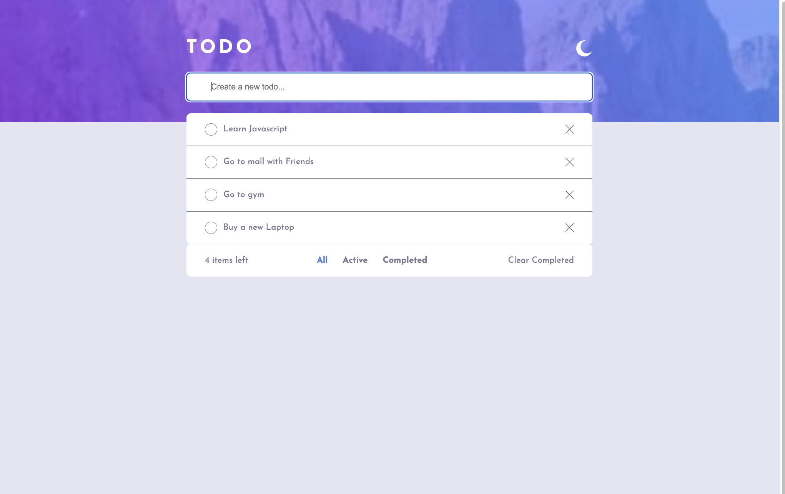

# Frontend Mentor - Todo app solution

This is a solution to the [Todo app challenge on Frontend Mentor](https://www.frontendmentor.io/challenges/todo-app-Su1_KokOW). Frontend Mentor challenges help you improve your coding skills by building realistic projects.

## Table of contents

- [Overview](#overview)
  - [The challenge](#the-challenge)
  - [Screenshot](#screenshot)
  - [Links](#links)
- [My process](#my-process)
  - [Built with](#built-with)
  - [What I learned](#what-i-learned)
  - [Continued development](#continued-development)
  - [Useful resources](#useful-resources)
- [Author](#author)

## Overview

### The challenge

Users should be able to:

- View the optimal layout for the app depending on their device's screen size
- See hover states for all interactive elements on the page
- Add new todos to the list
- Mark todos as complete
- Delete todos from the list
- Filter by all/active/complete todos
- Clear all completed todos
- Toggle light and dark mode
- **Bonus**: Drag and drop to reorder items on the list

### Screenshot

### Links

- Solution URL: [https://github.com/ajay117/todo-app](https://github.com/ajay117/todo-app)
- Live Site URL: [https://ajay117.github.io/todo-app/](https://ajay117.github.io/todo-app/)

## My process

### Built with

- Semantic HTML5 markup
- CSS custom properties
- Flexbox
- JavaScript Dom Manipulation
- Mobile-first workflow
- Prettier
- ES lint
- Babel
- Webpack

### What I learned

Had a lot of fun while doing this project thanks to frontend mentor for this challenge.
Learned a lot about DOM manipulation and other stuffs.

### Continued development

Later want to do some code refactor and add some drag and drop to reorder list.

### Useful resources

- [Check if an element has event listener on it. No jQuery [duplicate]](https://stackoverflow.com/questions/28056716/check-if-an-element-has-event-listener-on-it-no-jquery) - This helped me to recall and helped me to check if an element has event listener on it, prevented to add duplicate listeners.

## Author

- Website - [Ajay KC](https://github.com/ajay117)
- Frontend Mentor - [@ajay117](https://www.frontendmentor.io/profile/ajay117)
- Twitter - [@Ajay49903701](https://www.twitter.com/Ajay49903701)
